# AI医疗诊断辅助系统需求规格说明书

**版本：** V2.2  
**更新日期：** 2025-06-09  
**项目代码：** MEDICAL-AI-002  

---
# AI医疗诊断辅助系统需求规格说明书 - 文档修订记录表

| Date 日期 | Revision Version 修订版本 | CR ID /Defect ID CR/ Defect号 | Sec No. 修改章节 | Change Description 修改描述 | Author 作者 |
|---------------|------------------------------|-----------------------------------|---------------------|--------------------------------|----------------|
| 2025-05-28 | V1.0 | - | 全部 | 初始版本创建，包含基本功能需求 | 项目团队 |
| 2025-06-04 | V1.5 | CR-001 | 2.3, 3.2 | 调整用户角色设计，完善权限管理需求 | 需求分析师 |
| 2025-06-05 | V2.0 | CR-002 | 3.6, 3.7, 3.8 | 完善功能模块，添加数据统计和导入导出功能 | 系统分析师 |
| 2025-06-05 | V2.1 | CR-003 | 2.1, 3.4, 3.5 | 调整AI服务架构，AI诊断改为Java调用大模型 | 技术架构师 |
| 2025-06-09 | V2.2 | CR-004 | 1.4, 2.1, 3.5, 3.8 | 统一AI服务架构，血常规分析改为Java后端调用大模型API，调整数据模型 | 项目团队 |
| 2025-06-09 | V2.2 | CR-005 | 4, 5, 6, 7, 9 | 补充性能需求、接口需求、设计约束、质量特性和附录章节 | 系统分析师 |

## Keywords 关键词：
AI医疗诊断、大模型、血常规分析、智能诊断、医疗信息系统

## Abstract 摘要：
AI医疗诊断辅助系统是一个基于大语言模型技术的医疗信息化平台，旨在为医疗机构提供智能化的诊断辅助服务。系统通过集成先进的AI技术，实现症状分析、血常规智能解读、诊断建议生成等核心功能，帮助医生提高诊疗效率和准确性。本系统采用B/S架构，支持多用户并发访问，具备完善的权限管理、数据安全和审计功能。

## List of abbreviations 缩略语清单：

| Abbreviations缩略语 | Full spelling 英文全名 | Chinese explanation 中文解释 |
|-------------------|----------------------|---------------------------|
| AI | Artificial Intelligence | 人工智能 |
| API | Application Programming Interface | 应用程序编程接口 |
| JWT | JSON Web Token | JSON网络令牌 |
| RBAC | Role-Based Access Control | 基于角色的访问控制 |
| REST | Representational State Transfer | 表现状态转移 |
| LLM | Large Language Model | 大语言模型 |
| CBC | Complete Blood Count | 血常规检验 |
| WBC | White Blood Cell | 白细胞 |
| RBC | Red Blood Cell | 红细胞 |
| HGB | Hemoglobin | 血红蛋白 |
| PLT | Platelet | 血小板 |
| HTTPS | HyperText Transfer Protocol Secure | 超文本传输安全协议 |
| SQL | Structured Query Language | 结构化查询语言 |
| JSON | JavaScript Object Notation | JavaScript对象标记 |
| PDF | Portable Document Format | 便携式文档格式 |

---

## 1 简介

### 1.1 目的

该需求规格说明书是关于AI医疗诊断辅助系统用户对于智能诊断和血常规分析功能的要求描述，该说明书的预期读者为：
- 医疗机构用户（医生、管理员）；
- 项目管理人员；
- 测试人员；
- 系统设计人员；
- 软件开发人员。

这份软件需求说明书重点描述了AI医疗诊断辅助系统的功能需求，明确所要开发的软件应具有的功能、性能与界面，使系统分析人员及软件开发人员能清楚地了解用户的需求，为后续的系统设计、开发和测试提供依据。

## 2 总体概述

### 2.1 软件概述

#### 2.1.1 项目介绍

本项目是一个全新的医疗信息化项目，旨在通过集成大语言模型技术，为医疗机构提供智能化的诊断辅助服务。系统采用现代化的Web技术架构，支持云端部署和本地化部署，能够与医疗机构现有的信息系统进行集成。

项目背景：随着人工智能技术的快速发展，医疗行业对智能化诊断辅助工具的需求日益增长。本系统通过集成先进的大语言模型，能够为医生提供专业的诊断建议和血常规分析，提升医疗服务质量。

### 2.2 软件功能

系统功能结构图如下：

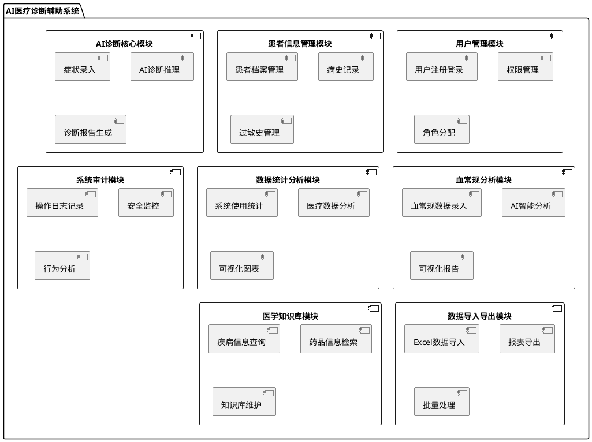

**子系统功能概述：**

- **用户管理模块**：负责系统用户的注册、登录、权限控制和角色管理
- **患者信息管理模块**：管理患者档案、病史记录和相关医疗信息
- **AI诊断核心模块**：实现症状分析和智能诊断推理功能
- **血常规分析模块**：提供血常规数据分析和智能解读服务
- **数据统计分析模块**：生成各类统计报表和可视化图表
- **系统审计模块**：记录用户操作日志，提供安全监控功能
- **数据导入导出模块**：支持批量数据处理和报表导出
- **医学知识库模块**：提供医学知识查询和管理功能

### 2.3 用户特征

**医生用户：**
- 具备医学专业背景和临床经验
- 熟悉医疗信息系统的基本操作
- 具备基本的计算机操作能力
- 期望系统操作简便、响应快速
- 重视系统的专业性和准确性

**管理员用户：**
- 具备医疗机构管理经验
- 熟悉信息系统管理操作
- 具备一定的IT技术背景
- 需要监控系统运行状态
- 负责用户管理和权限分配

本节不描述具体的功能需求，但为后续具体需求章节提供用户背景基础。

## 3 具体需求

### 3.1 系统用例

系统高层整体用例如下图：

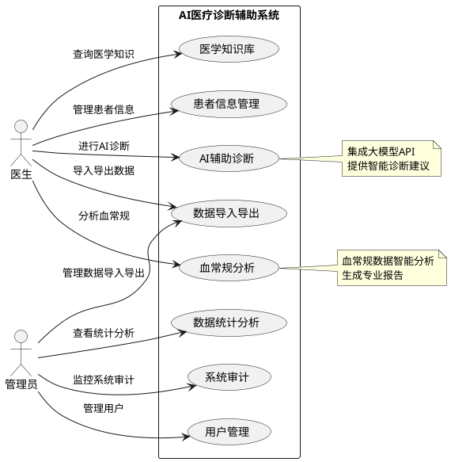

### 3.2 用户管理模块

**1、子功能功能简介**

用户管理模块负责系统的用户注册、登录认证、权限管理和角色分配。支持医生和管理员两种用户角色，基于RBAC模型实现细粒度权限控制。

**2、子功能系统用例**

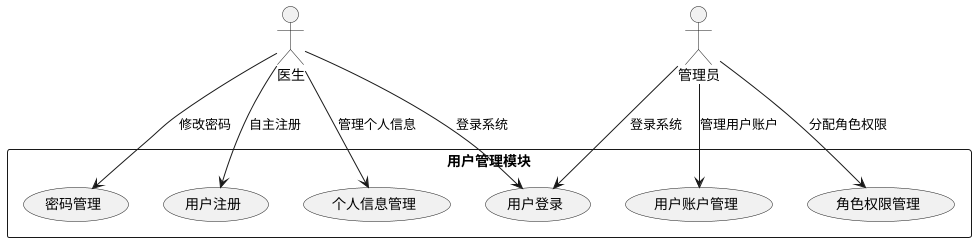

#### 3.2.1 用户登录

**1 介绍**

用户通过用户名和密码登录系统，系统验证用户身份后生成访问令牌，用户获得相应权限访问系统功能。系统需要处理登录失败、账户锁定等异常情况。

**2 输入**

本子段落包含下列内容：
A. 对该功能所有输入数据的详细描述：
- 输入来源：用户通过Web浏览器输入
- 数量：用户名（1个）、密码（1个）
- 度量单位：字符串
- 时间要求：实时输入验证
- 有效输入范围：用户名长度3-50字符，密码长度6-20字符

B. 接口规格参考：
- HTTP POST请求到 /api/v1/auth/login
- Content-Type: application/json

**3 处理**

本子段落描述对输入数据所执行的所有操作：

A. 输入数据的有效性检测：
- 验证用户名格式（字母数字下划线组合）
- 验证密码复杂度要求
- 检查必填字段完整性

B. 操作的确切次序：
1. 接收用户登录请求
2. 验证输入格式
3. 查询用户信息
4. 验证密码（MD5加密对比）
5. 检查账户状态
6. 生成JWT令牌
7. 记录登录日志
8. 返回登录结果

C. 对异常情况的回应：
- 用户名不存在：返回"用户名或密码错误"
- 密码错误：返回"用户名或密码错误"，连续失败5次锁定账户
- 账户被禁用：返回"账户已被禁用，请联系管理员"
- 系统错误：返回"系统繁忙，请稍后重试"

D. 数据转换方法：
- 密码MD5哈希算法验证
- JWT令牌生成算法（包含用户ID、角色、过期时间）

**活动图：**
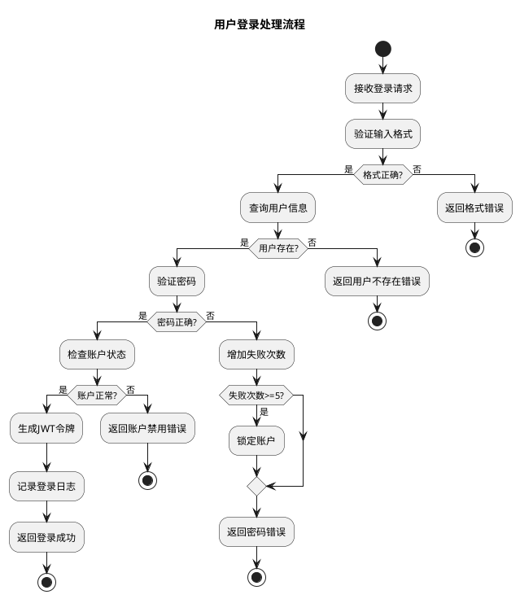

**4 输出**

本子段落包含：
A. 对该功能所有输出数据的详细描述：
- 输出到何处：Web浏览器（JSON响应）
- 数量：1个响应对象
- 度量单位：JSON格式
- 时序：登录验证完成后立即返回
- 有效输出范围：成功时包含JWT令牌和用户信息，失败时包含错误信息
- 对非法值的处理：返回标准错误响应格式
- 错误消息：统一错误代码和描述

B. 接口规格参考：
- HTTP响应状态码：200（成功）、400（请求错误）、401（认证失败）
- 响应格式：`{"code": 200, "message": "success", "data": {...}}`

#### 3.2.2 用户权限管理

**1 介绍**

管理员可以查看、修改用户账户状态，分配和调整用户角色权限。系统基于RBAC模型实现权限控制，支持医生和管理员两种角色，每种角色具有不同的功能权限。

**2 输入**

本子段落包含下列内容：
A. 对该功能所有输入数据的详细描述：
- 输入来源：管理员通过Web界面操作
- 数量：用户ID（1个）、角色信息（1个）、操作类型（1个）
- 度量单位：数字ID、字符串
- 时间要求：实时处理
- 有效输入范围：用户ID为正整数，角色为DOCTOR或ADMIN

B. 接口规格参考：
- HTTP PUT请求到 /api/v1/users/{id}/role
- Content-Type: application/json

**3 处理**

本子段落描述对输入数据所执行的所有操作：

A. 输入数据的有效性检测：
- 验证用户ID存在性
- 验证角色类型有效性
- 检查操作权限

B. 操作的确切次序：
1. 验证管理员权限
2. 查询目标用户信息
3. 验证角色变更合法性
4. 更新用户角色
5. 记录操作日志
6. 返回操作结果

C. 对异常情况的回应：
- 无权限操作：返回"权限不足"
- 用户不存在：返回"用户不存在"
- 角色无效：返回"无效的角色类型"

D. 权限验证算法：
- 基于JWT令牌验证管理员身份
- 检查目标用户是否可被当前管理员管理

**4 输出**

本子段落包含：
A. 对该功能所有输出数据的详细描述：
- 输出到何处：Web浏览器和审计日志
- 数量：1个操作结果响应
- 度量单位：JSON格式
- 时序：权限变更完成后立即返回
- 有效输出范围：成功时返回更新后的用户信息
- 错误消息：详细的权限操作错误描述

### 3.3 患者信息管理模块

**1、子功能功能简介**

患者信息管理模块负责患者档案的创建、查询、维护和病史管理。支持患者基本信息录入、既往病史记录、过敏史管理等功能。

**2、子功能系统用例**

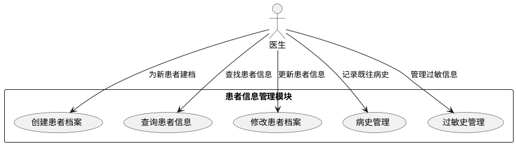

#### 3.3.1 患者档案创建

**1 介绍**

医生为新患者建立电子档案，录入患者基本信息，系统自动生成唯一患者ID。需要验证数据完整性和唯一性，防止重复建档。

**2 输入**

A. 对该功能所有输入数据的详细描述：
- 输入来源：医生通过Web表单输入
- 数量：患者姓名、性别、出生日期、身份证号、联系方式等8-10个字段
- 度量单位：文本字符串、日期格式
- 时间要求：实时验证，5分钟内完成录入
- 有效输入范围：姓名2-50字符，身份证号18位，手机号11位

**3 处理**

A. 输入数据的有效性检测：
- 身份证号格式验证（18位数字+校验位）
- 手机号格式验证（11位数字）
- 出生日期合理性检验

B. 操作次序：
1. 接收患者信息
2. 数据格式验证
3. 重复档案检查
4. 生成患者编号
5. 保存患者档案
6. 返回创建结果

**活动图：**
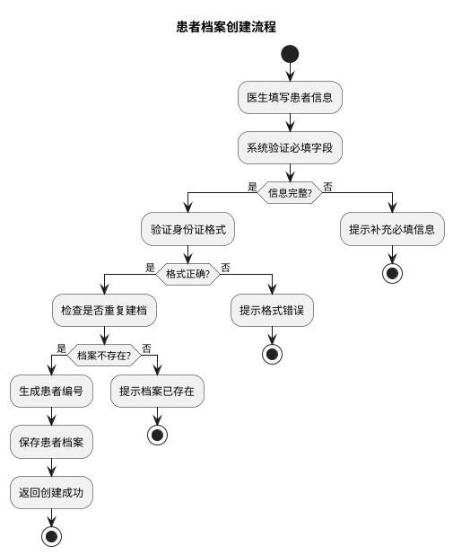

**4 输出**

A. 输出数据描述：
- 输出到Web界面和数据库
- 成功时返回患者ID和确认信息
- 失败时返回具体错误原因
- 时序：验证完成后立即返回

### 3.4 AI诊断核心模块

**1、子功能功能简介**

AI诊断核心模块是系统的核心功能，通过集成大语言模型技术，实现症状分析和智能诊断推理。医生录入患者症状后，系统调用大模型API生成诊断建议。

**2、子功能系统用例**

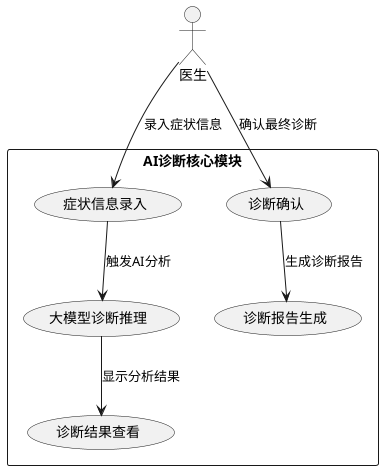

#### 3.4.1 症状信息录入

**1 介绍**

医生为患者录入当前症状和体征信息，支持结构化症状选择和自由文本描述。系统提供症状分类树和快速录入功能，确保症状信息的准确性和完整性。

**2 输入**

A. 输入数据详细描述：
- 输入来源：医生通过Web界面录入
- 主诉（必填）：患者主要不适症状描述
- 现病史：症状发展过程和特点
- 体格检查：物理检查结果
- 生命体征：体温、血压、心率、呼吸频率
- 时间要求：支持分步录入，可暂存

**3 处理**

操作流程：
1. 症状信息结构化处理
2. 数据完整性验证
3. 生命体征异常值检测
4. 症状关键词提取
5. 为AI分析准备数据

**4 输出**

输出描述：
- 症状信息汇总展示
- 异常值高亮提示
- AI分析准备就绪状态

#### 3.4.2 大模型诊断推理

**1 介绍**

基于录入的症状信息，调用大模型API进行智能诊断推理。系统构建专业的医疗提示词，整合患者信息和症状描述，获取AI诊断建议。

**2 输入**

A. 输入数据：
- 患者症状信息（结构化和非结构化）
- 生命体征数据
- 既往病史信息
- 过敏史信息

**3 处理**

A. 处理步骤：
1. 构建医疗专业提示词
2. 整合患者信息和症状
3. 调用大模型API
4. 解析AI响应结果
5. 格式化诊断建议
6. 记录API调用日志

B. 异常处理：
- API调用失败：提供降级方案
- 响应超时：重试机制
- 结果解析错误：错误日志记录

**活动图：**
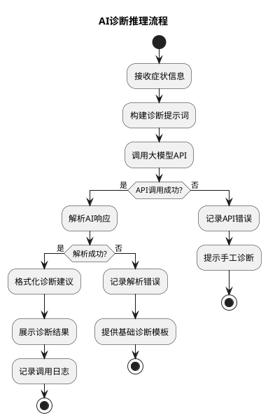

**4 输出**

A. 输出数据：
- AI诊断建议列表
- 疾病可能性评估
- 建议检查项目
- 治疗方案建议
- 风险等级评估

### 3.5 血常规分析模块

**1、子功能功能简介**

血常规分析模块专门处理血液常规检验数据的录入、分析和报告生成。通过AI技术对血常规指标进行智能解读，生成专业的分析报告。

**2、子功能系统用例**

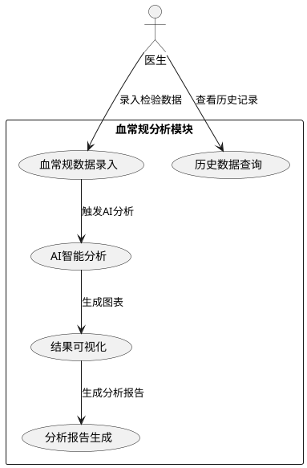

#### 3.5.1 血常规数据录入

**1 介绍**

医生手动录入血常规检验结果，系统自动进行数据验证和异常值标记。支持6个核心血常规指标的录入和管理。

**2 输入**

A. 核心指标输入：
- WBC（白细胞计数）：4.0-10.0 × 10⁹/L
- RBC（红细胞计数）：4.0-5.5 × 10¹²/L  
- HGB（血红蛋白）：120-160 g/L
- PLT（血小板计数）：100-300 × 10⁹/L
- NEUTp（中性粒细胞%）：50-70%
- LYMp（淋巴细胞%）：20-40%
- 检查日期：必填项

**3 处理**

处理流程：
1. 数据格式验证
2. 参考范围对比
3. 异常值自动标记
4. 数据完整性检查
5. 保存到数据库

**4 输出**

输出结果：
- 录入成功确认
- 异常值高亮显示
- 数据保存状态

#### 3.5.2 AI智能分析

**1 介绍**

基于血常规指标数据，调用大模型API进行专业的血液学分析。系统构建血常规专业提示词，获取AI分析结果和疾病风险评估。

**2 输入**

输入数据：
- 6个核心血常规指标值
- 患者基本信息（年龄、性别）
- 检查日期和时间

**3 处理**

A. 分析处理：
1. 构建血常规分析提示词
2. 调用大模型API
3. 解析JSON格式分析结果
4. 异常指标识别
5. 疾病风险评估
6. 生成分析报告

**活动图：**
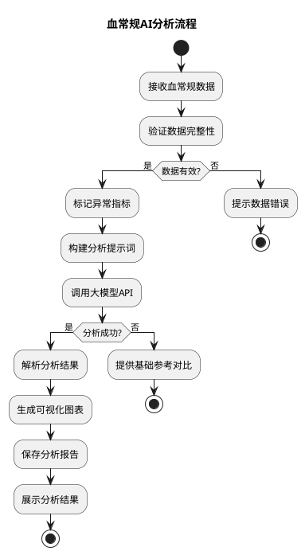

**4 输出**

分析结果：
- 整体分析总结
- 异常指标详细解读
- 疾病风险提示
- 建议检查项目
- 随访建议

### 3.6 数据导入导出模块

**1、子功能功能简介**

数据导入导出模块支持批量数据处理功能，包括Excel格式的血常规数据导入和各类报表的导出功能，提高数据处理效率。

**2、子功能系统用例**

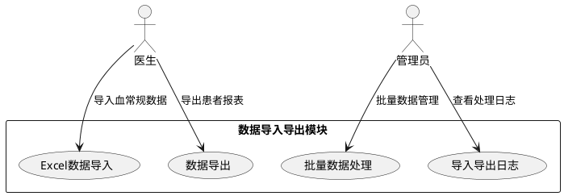

#### 3.6.1 Excel数据导入

**1 介绍**

支持Excel格式的血常规数据批量导入功能，医生可以将检验科提供的Excel数据文件批量导入系统，减少手工录入工作量。

**2 输入**

A. 输入数据描述：
- 输入来源：用户上传的Excel文件
- 文件格式：.xlsx或.xls格式
- 数据量：单次最多1000条记录
- 必需字段：患者信息、检测日期、6个核心血常规指标
- 时间要求：文件大小不超过10MB

**3 处理**

A. 处理流程：
1. 文件格式验证
2. Excel数据解析
3. 数据格式验证
4. 重复数据检查
5. 批量保存到数据库
6. 生成导入报告

B. 异常处理：
- 文件格式错误：提示支持的文件格式
- 数据格式错误：详细错误位置和原因
- 重复数据：提示重复记录信息

**4 输出**

A. 输出结果：
- 导入成功数量统计
- 失败记录详细信息
- 数据验证错误报告
- 处理进度实时显示

### 3.7 医学知识库模块

**1、子功能功能简介**

医学知识库模块提供疾病信息和药品信息的查询功能，为医生提供辅助参考信息，支持知识库内容的维护和管理。

**2、子功能系统用例**

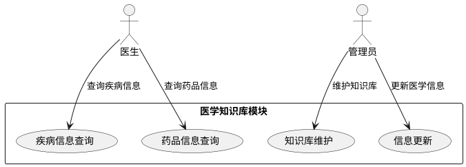

#### 3.7.1 疾病信息查询

**1 介绍**

提供疾病基础信息的查询功能，支持按疾病名称、ICD-10编码、症状关键词等多种方式查询疾病信息。

**2 输入**

A. 查询条件：
- 疾病名称：支持模糊匹配
- ICD-10编码：精确匹配
- 症状关键词：多关键词组合查询
- 疾病分类：按系统分类筛选

**3 处理**

A. 查询处理：
1. 输入条件验证
2. 多条件组合查询
3. 结果相关性排序
4. 分页显示处理

**4 输出**

A. 查询结果：
- 疾病详细信息
- 主要症状描述
- 诊断要点
- 治疗建议
- 相关疾病推荐
- 
# 3.8 系统审计模块

**1、子功能功能简介**

系统审计模块负责记录用户操作、系统错误和AI调用等关键信息，为系统安全监控和问题追溯提供完整的日志记录。通过统一的日志表设计，实现对所有系统活动的全面记录和管理。

**2、子功能系统用例**

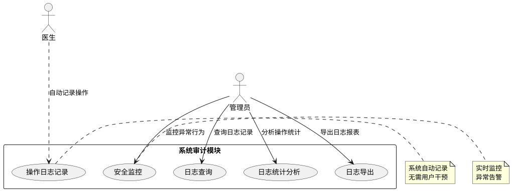

## 3.8.1 操作日志记录

**1 介绍**

系统自动记录所有用户操作、系统错误和AI调用信息。包括用户登录登出、患者信息操作、诊断操作、血常规分析、数据导入导出等关键操作，确保系统操作的完整追溯。

**2 输入**

本子段落包含下列内容：
A. 对该功能所有输入数据的详细描述：
- 输入来源：系统自动拦截用户操作和系统事件
- 数量：用户信息、操作信息、环境信息、结果信息等多项数据
- 度量单位：文本字符串、数字、时间戳
- 时间要求：实时记录，异步处理
- 有效输入范围：所有系统操作和事件

B. 数据采集内容：
- 用户信息：用户ID、用户名、角色
- 操作信息：操作类型、操作描述、目标对象
- 环境信息：IP地址、浏览器信息、会话ID
- 结果信息：操作状态、错误信息、执行时间

**3 处理**

本子段落描述对输入数据所执行的所有操作：

A. 输入数据的有效性检测：
- 验证用户身份信息
- 检查操作类型有效性
- 验证时间戳格式

B. 操作的确切次序：
1. 系统拦截用户操作或系统事件
2. 提取关键信息数据
3. 确定日志类型和级别
4. 构建标准化日志记录
5. 异步写入日志数据库
6. 检查是否触发告警条件
7. 必要时发送实时告警

C. 对异常情况的回应：
- 数据库写入失败：本地文件备份
- 磁盘空间不足：自动清理过期日志
- 系统异常：降级为基础日志记录

D. 日志分类处理方法：
- OPERATION类型：记录用户操作行为
- ERROR类型：记录系统错误和异常
- AI_CALL类型：记录大模型API调用详情

**4 输出**

本子段落包含：
A. 对该功能所有输出数据的详细描述：
- 输出到何处：系统日志数据库表
- 数量：每个操作生成1条日志记录
- 度量单位：数据库记录行
- 时序：操作完成后立即记录
- 有效输出范围：完整的日志记录信息
- 对非法值的处理：异常数据标记和容错处理
- 错误消息：日志记录失败的错误提示

B. 日志输出格式：统一的数据库表结构，JSON格式扩展数据

**活动图：**
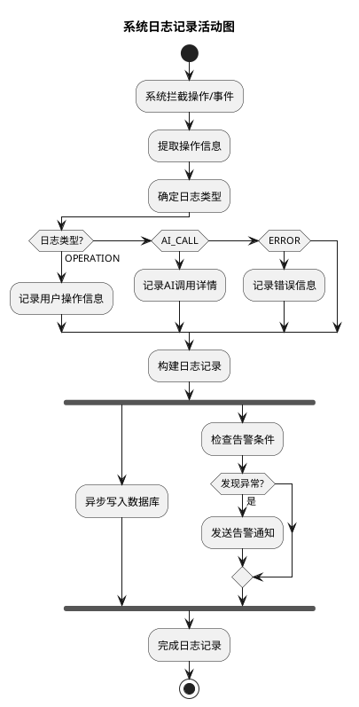

## 3.8.2 日志查询和分析

**1 介绍**

管理员可以查询和分析系统日志，支持多条件组合查询、统计分析和报表导出。提供直观的界面展示操作记录、错误统计和AI调用情况。

**2 输入**

本子段落包含下列内容：
A. 对该功能所有输入数据的详细描述：
- 输入来源：管理员通过Web界面输入查询条件
- 数量：查询时间范围、用户筛选、操作类型等多个条件
- 度量单位：日期时间、文本字符串
- 时间要求：支持实时查询
- 有效输入范围：
    - 时间范围：最长支持1年内数据查询
    - 用户筛选：系统内有效用户
    - 操作类型：预定义的操作类型列表

B. 查询条件参考：
- 时间范围：开始日期、结束日期
- 日志类型：OPERATION/ERROR/AI_CALL
- 用户筛选：用户ID、用户名
- 操作类型：具体操作代码
- 状态筛选：SUCCESS/FAILED/ERROR

**3 处理**

本子段落描述对输入数据所执行的所有操作：

A. 输入数据的有效性检测：
- 验证管理员权限
- 检查时间范围合理性
- 验证查询条件格式

B. 操作的确切次序：
1. 验证管理员访问权限
2. 解析查询条件参数
3. 构建SQL查询语句
4. 执行数据库查询
5. 对敏感信息进行脱敏处理
6. 结果分页和排序
7. 生成统计分析数据
8. 返回查询结果

C. 对异常情况的回应：
- 查询超时：限制查询时间范围
- 结果过多：强制分页显示
- 权限不足：返回权限错误提示

D. 查询优化方法：
- 使用数据库索引提高查询效率
- 分页查询避免大数据量加载
- 缓存常用查询结果

**4 输出**

本子段落包含：
A. 对该功能所有输出数据的详细描述：
- 输出到何处：Web界面和Excel文件
- 数量：根据查询条件返回相应记录数
- 度量单位：日志记录条数、统计数值
- 时序：查询完成后立即显示
- 有效输出范围：分页显示，每页最多100条记录
- 对非法值的处理：异常数据标记显示
- 错误消息：查询失败的详细错误信息

B. 输出格式：
- 列表展示：表格形式显示日志记录
- 统计图表：操作统计和趋势分析
- 导出文件：Excel格式的日志报表

### 3.9 数据字典

#### 3.9.1 数据字典

**用户表（doctor）**

| 字段 | 类型 | 可为空 | 描述 |
|------|------|--------|------|
| id | BIGINT | 否 | 主键ID |
| username | VARCHAR(50) | 否 | 登录用户名 |
| password | VARCHAR(255) | 否 | 加密密码 |
| real_name | VARCHAR(100) | 否 | 真实姓名 |
| role | VARCHAR(20) | 否 | 用户角色 |
| department | VARCHAR(50) | 是 | 科室 |
| status | TINYINT | 否 | 账户状态 |

**患者表（patient）**

| 字段 | 类型 | 可为空 | 描述 |
|------|------|--------|------|
| id | BIGINT | 否 | 主键ID |
| patient_no | VARCHAR(50) | 否 | 患者编号 |
| name | VARCHAR(100) | 否 | 患者姓名 |
| gender | TINYINT | 是 | 性别 |
| birth_date | DATE | 是 | 出生日期 |
| id_card | VARCHAR(20) | 是 | 身份证号 |
| phone | VARCHAR(20) | 是 | 联系电话 |

**血常规表（blood_test）**

| 字段 | 类型 | 可为空 | 描述 |
|------|------|--------|------|
| id | BIGINT | 否 | 主键ID |
| patient_id | BIGINT | 否 | 患者ID |
| test_date | DATETIME | 否 | 检测日期 |
| WBC | DECIMAL(6,2) | 是 | 白细胞计数 |
| RBC | DECIMAL(6,2) | 是 | 红细胞计数 |
| HGB | DECIMAL(6,1) | 是 | 血红蛋白 |
| PLT | DECIMAL(6,1) | 是 | 血小板计数 |
| NEUTp | DECIMAL(5,1) | 是 | 中性粒细胞% |
| LYMp | DECIMAL(5,1) | 是 | 淋巴细胞% |
| ai_analysis_result | JSON | 是 | AI分析结果 |

**诊断记录表（diagnosis_record）**

| 字段 | 类型 | 可为空 | 描述 |
|------|------|--------|------|
| id | BIGINT | 否 | 主键ID |
| patient_id | BIGINT | 否 | 患者ID |
| doctor_id | BIGINT | 否 | 医生ID |
| symptoms_text | TEXT | 是 | 症状描述 |
| final_diagnosis | TEXT | 是 | 最终诊断 |
| diagnosis_time | DATETIME | 否 | 诊断时间 |

***系统日志表 (system_log)***

| 字段名 | 数据类型 | 可为空 | 描述 |
|--------|----------|--------|------|
| id | BIGINT | 否 | 主键ID |
| log_type | VARCHAR(20) | 否 | 日志类型：OPERATION/ERROR/AI_CALL |
| user_id | BIGINT | 是 | 用户ID |
| username | VARCHAR(50) | 是 | 用户名 |
| action_type | VARCHAR(50) | 否 | 操作类型 |
| action_desc | VARCHAR(200) | 是 | 操作描述 |
| target_id | VARCHAR(50) | 是 | 操作对象ID |
| ip_address | VARCHAR(45) | 是 | IP地址 |
| status | VARCHAR(20) | 否 | 状态：SUCCESS/FAILED/ERROR |
| error_message | VARCHAR(500) | 是 | 错误信息 |
| log_time | DATETIME | 否 | 操作时间 |
| create_time | DATETIME | 否 | 创建时间 |

***日志类型字典***

| 类型代码 | 类型名称 | 说明 |
|----------|----------|------|
| OPERATION | 操作日志 | 用户操作记录 |
| ERROR | 错误日志 | 系统错误记录 |
| AI_CALL | AI调用日志 | 大模型API调用记录 |

***操作类型字典***

| 操作代码 | 操作名称 | 日志类型 | 说明 |
|----------|----------|----------|------|
| USER_LOGIN | 用户登录 | OPERATION | 用户登录系统 |
| USER_LOGOUT | 用户登出 | OPERATION | 用户退出系统 |
| PATIENT_CREATE | 患者创建 | OPERATION | 创建患者档案 |
| PATIENT_UPDATE | 患者更新 | OPERATION | 更新患者信息 |
| DIAGNOSIS_CREATE | 诊断创建 | OPERATION | 创建诊断记录 |
| DIAGNOSIS_AI | AI诊断 | AI_CALL | 调用AI诊断功能 |
| BLOODTEST_CREATE | 血常规创建 | OPERATION | 创建血常规记录 |
| BLOODTEST_AI | 血常规AI分析 | AI_CALL | 调用血常规AI分析 |
| DATA_IMPORT | 数据导入 | OPERATION | 导入Excel数据 |
| DATA_EXPORT | 数据导出 | OPERATION | 导出数据报表 |
| SYSTEM_ERROR | 系统错误 | ERROR | 系统运行错误 |
| API_ERROR | API错误 | ERROR | 外部API调用错误 |

***状态字典***

| 状态代码 | 状态名称 | 说明 |
|----------|----------|------|
| SUCCESS | 成功 | 操作成功完成 |
| FAILED | 失败 | 操作执行失败 |
| ERROR | 错误 | 系统异常错误 |

#### 3.9.2 E-R关系图

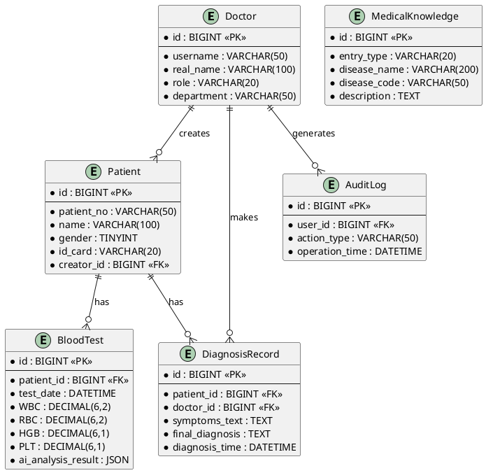

## 4 性能需求

### 4.1 时间性能需求

系统应满足以下时间性能要求：

- **用户登录响应时间**：≤ 2秒
- **页面加载时间**：首次加载 ≤ 5秒，后续页面切换 ≤ 3秒
- **大模型API调用时间**：诊断推理 ≤ 10秒，血常规分析 ≤ 8秒
- **数据查询响应时间**：简单查询 ≤ 3秒，复杂统计查询 ≤ 10秒
- **文件上传处理时间**：Excel文件导入（1000条记录以内）≤ 30秒
- **报告生成时间**：PDF报告生成 ≤ 5秒
- **数据库事务处理时间**：单个事务 ≤ 1秒

### 4.2 系统开放性需求

系统应具备良好的开放性和扩展性：

- **API接口标准**：遵循RESTful设计规范，支持JSON数据格式
- **协议支持**：支持HTTP/HTTPS协议，兼容WebSocket实时通信
- **数据格式兼容**：支持XML、JSON、Excel等多种数据格式
- **第三方集成**：预留标准接口，支持与HIS、LIS等系统集成
- **大模型扩展**：支持多种大模型API的灵活切换和配置
- **数据库兼容**：基于标准SQL，支持数据库迁移和升级

### 4.3 界面友好性需求

系统界面应符合用户体验要求：

- **浏览器兼容性**：支持Chrome 90+、Firefox 88+、Safari 14+、Edge 90+
- **屏幕分辨率**：支持1920x1080及以上分辨率，兼容1366x768
- **响应式设计**：自适应不同屏幕尺寸，优先支持桌面端
- **操作便捷性**：关键功能不超过3次点击到达，支持键盘快捷键
- **视觉设计**：采用医疗行业标准色彩，界面简洁专业
- **多语言支持**：预留国际化接口，当前版本支持简体中文
- **无障碍访问**：支持屏幕阅读器，符合WCAG 2.1 AA级标准

### 4.4 系统可用性需求

系统应保证高可用性运行：

- **系统可用性**：≥ 99%（年度停机时间不超过87.6小时）
- **并发用户数**：支持20名医生同时在线操作
- **服务连续性**：支持7×24小时持续运行
- **故障恢复时间**：平均故障恢复时间（MTTR）≤ 4小时
- **数据备份频率**：增量备份每日1次，完整备份每周1次
- **备份恢复时间**：数据恢复时间 ≤ 2小时
- **容错能力**：单点故障不影响系统核心功能

### 4.5 可管理性需求

系统应提供完善的管理功能：

- **系统监控**：实时监控系统运行状态、资源使用情况
- **日志管理**：自动记录系统日志，支持日志分级和自动归档
- **性能监控**：监控响应时间、吞吐量、错误率等关键指标
- **用户管理**：支持用户账户的创建、修改、禁用等操作
- **权限管理**：细粒度权限控制，支持角色和权限的灵活配置
- **配置管理**：支持系统参数的在线配置和热更新
- **告警机制**：异常情况自动告警，支持邮件和短信通知

## 5 接口需求

### 5.1 用户接口

系统应提供友好的用户操作界面：

**主要界面要求：**

- **登录界面**：简洁的登录表单，支持记住密码功能
- **工作台界面**：个人工作概览、快捷操作入口、通知提醒
- **患者管理界面**：患者列表、搜索筛选、详情查看、信息编辑
- **AI诊断界面**：症状录入表单、AI分析结果展示、诊断确认
- **血常规分析界面**：数据录入、可视化图表、分析报告
- **统计分析界面**：数据图表、报表查看、导出功能
- **系统管理界面**：用户管理、权限配置、系统监控

**界面设计要求：**

- 采用响应式布局，适配不同屏幕尺寸
- 统一的导航菜单和面包屑导航
- 清晰的表单验证提示和错误信息
- 支持主题切换（明亮/暗黑模式）

### 5.2 软件接口

系统需要与以下软件系统进行接口对接：

**大模型API接口：**

- **通义千问API**：支持阿里云通义千问大模型调用
- **ChatGPT API**：支持OpenAI GPT系列模型调用
- **其他大模型**：预留接口支持其他主流大模型
- **接口协议**：HTTPS RESTful API
- **数据格式**：JSON格式请求和响应
- **认证方式**：API Key认证

**数据库接口：**

- **MySQL数据库**：主要业务数据存储
- **连接方式**：JDBC连接池
- **事务支持**：支持ACID事务特性
- **读写分离**：支持主从数据库配置

**第三方服务接口：**

- **邮件服务**：支持SMTP协议发送系统通知
- **短信服务**：支持短信验证码和告警通知
- **文件存储**：支持本地存储和云存储（阿里云OSS等）

### 5.3 硬件接口

系统对硬件环境的接口要求：

**服务器硬件要求：**

- **CPU**：4核心以上，主频 ≥ 2.4GHz
- **内存**：8GB以上，推荐16GB
- **存储**：SSD硬盘，可用空间 ≥ 100GB
- **网络**：千兆网卡，稳定的网络连接

**客户端硬件要求：**

- **CPU**：双核心以上处理器
- **内存**：4GB以上
- **显示器**：分辨率 ≥ 1366x768，推荐1920x1080
- **网络**：宽带网络连接，带宽 ≥ 10Mbps

**外设支持：**

- 支持激光打印机打印报告
- 支持扫描仪录入纸质资料
- 支持USB接口的数据导入设备

### 5.4 通讯接口

系统采用的通讯协议和接口规范：

**网络协议：**

- **HTTP/HTTPS**：Web服务主要协议，强制使用HTTPS加密传输
- **WebSocket**：支持实时通信和消息推送
- **TCP/IP**：底层网络通信协议

**数据传输格式：**

- **JSON**：主要的数据交换格式
- **XML**：配置文件和特定接口使用
- **Excel**：数据导入导出格式
- **PDF**：报告生成格式

**API接口规范：**

- **RESTful架构**：统一的资源定位和操作方式
- **统一响应格式**：`{"code": 200, "message": "success", "data": {...}}`
- **HTTP状态码**：标准的HTTP状态码使用
- **版本控制**：API版本号管理 `/api/v1/`

**安全通讯要求：**

- **SSL/TLS加密**：所有数据传输使用加密通道
- **API密钥认证**：第三方接口调用认证
- **JWT令牌**：用户身份认证和授权
- **请求签名**：关键接口使用数字签名验证

## 6 总体设计约束

### 6.1 标准符合性

系统设计和开发应符合以下标准要求：

**医疗信息标准：**

- **ICD-10**：国际疾病分类第10版标准
- **HL7 FHIR**：医疗信息交换标准（预留接口）
- **DICOM**：医学影像传输标准（预留扩展）

**信息安全标准：**

- **ISO 27001**：信息安全管理体系标准
- **等保2.0**：网络安全等级保护基本要求
- **GDPR**：通用数据保护法规（数据隐私保护）

**软件开发标准：**

- **ISO 9126**：软件质量特性标准
- **IEEE 830**：软件需求规格说明书标准
- **ISO 14155**：医疗器械软件生命周期过程标准

**Web技术标准：**

- **W3C标准**：HTML5、CSS3、JavaScript标准
- **HTTP/1.1和HTTP/2**：Web通信协议标准
- **OAuth 2.0**：开放授权标准

### 6.2 硬件约束

系统部署和运行的硬件约束条件：

**服务器环境约束：**

- **操作系统**：Linux（CentOS 7+、Ubuntu 18.04+、RHEL 7+）
- **虚拟化支持**：支持VMware、Docker容器化部署
- **负载均衡**：支持Nginx、HAProxy等负载均衡器
- **存储要求**：建议使用RAID配置提高数据安全性

**网络环境约束：**

- **带宽要求**：服务器出口带宽 ≥ 100Mbps
- **网络稳定性**：网络丢包率 ≤ 0.1%，延迟 ≤ 50ms
- **防火墙配置**：开放必要的端口（80、443、3306等）

**备份和灾难恢复：**

- **异地备份**：建议配置异地备份存储
- **UPS电源**：服务器配备不间断电源
- **环境监控**：机房温湿度监控和告警

### 6.3 技术限制

系统开发和部署的技术约束：

**开发技术约束：**

- **后端技术栈**：必须使用Java 11+、Spring Boot 2.7+
- **前端技术栈**：必须使用Vue 3、TypeScript、Element Plus
- **数据库技术**：必须使用MySQL 8.0+，不允许使用其他关系型数据库
- **缓存技术**：可选择Redis或Memcached

**安全技术约束：**

- **加密算法**：数据加密使用AES-256，传输加密使用TLS 1.2+
- **密码策略**：密码复杂度要求，定期更换策略
- **访问控制**：基于RBAC模型，最小权限原则

**性能技术约束：**

- **并发限制**：单服务器最大支持20并发用户
- **内存使用**：JVM堆内存不超过服务器总内存的70%
- **数据库连接**：数据库连接池最大连接数不超过100

**第三方依赖约束：**

- **大模型API**：需要稳定的外网访问能力
- **开源组件**：使用的开源组件必须具有商业友好的许可证
- **商业软件**：避免使用需要昂贵许可费的商业软件

## 7 软件质量特性

### 7.1 可靠性

系统应具备高可靠性，保证医疗数据的安全和服务的稳定：

**容错性要求：**

- **异常处理**：所有异常情况都有相应的处理机制
- **数据一致性**：确保数据库事务的ACID特性
- **服务降级**：大模型API不可用时提供基础功能
- **自动恢复**：系统故障后能够自动重启和恢复

**故障预防：**

- **输入验证**：严格的数据输入验证防止错误数据
- **资源监控**：实时监控系统资源使用情况
- **定期维护**：定期进行系统维护和更新

**数据完整性：**

- **备份策略**：多层次的数据备份机制
- **数据校验**：关键数据的完整性校验
- **版本控制**：重要数据变更的版本管理

### 7.2 易用性

系统应具备良好的易用性，降低用户学习成本：

**学习性要求：**

- **新用户培训**：医生用户2小时内掌握基本操作
- **操作指南**：提供完整的在线帮助和操作手册
- **视频教程**：关键功能提供视频演示

**操作性要求：**

- **界面一致性**：统一的界面风格和交互模式
- **快捷操作**：常用功能提供快捷方式和批量操作
- **错误提示**：清晰的错误信息和解决建议

**用户满意度：**

- **响应速度**：快速的系统响应提升用户体验
- **功能完整性**：满足用户实际工作需求
- **个性化设置**：支持用户自定义界面和偏好设置

### 7.3 安全性

系统应具备完善的安全防护能力：

**访问控制：**

- **身份认证**：强制用户身份验证，支持双因子认证
- **权限管理**：基于角色的细粒度权限控制
- **会话管理**：安全的会话管理和超时控制

**数据保护：**

- **数据加密**：敏感数据加密存储和传输
- **隐私保护**：患者隐私信息的匿名化处理
- **访问审计**：完整的数据访问日志记录

**系统防护：**

- **漏洞防护**：防止SQL注入、XSS、CSRF等常见攻击
- **网络安全**：防火墙配置和网络访问控制
- **病毒防护**：文件上传的安全扫描

### 7.4 可维护性

系统应具备良好的可维护性，便于后期维护和升级：

**模块化设计：**

- **松耦合架构**：模块间低耦合，便于独立维护
- **标准接口**：标准化的模块接口定义
- **代码规范**：统一的编码规范和注释标准

**可扩展性：**

- **功能扩展**：预留功能扩展接口和配置
- **性能扩展**：支持水平扩展和负载均衡
- **技术升级**：支持技术组件的平滑升级

**运维支持：**

- **监控告警**：完善的系统监控和告警机制
- **日志分析**：详细的系统日志和分析工具
- **版本管理**：代码版本控制和发布管理

## 8 需求分级

| Requirement ID | Requirement Name | Classification |
|----------------|------------------|----------------|
| REQ-USER-001 | 用户登录功能 | 必须的 |
| REQ-USER-002 | 用户权限管理 | 必须的 |
| REQ-PATIENT-001 | 患者档案管理 | 必须的 |
| REQ-PATIENT-002 | 病史管理 | 重要的 |
| REQ-DIAGNOSIS-001 | 症状信息录入 | 必须的 |
| REQ-DIAGNOSIS-002 | AI诊断推理 | 必须的 |
| REQ-BLOODTEST-001 | 血常规数据录入 | 必须的 |
| REQ-BLOODTEST-002 | AI血常规分析 | 必须的 |
| REQ-STATISTICS-001 | 系统使用统计 | 重要的 |
| REQ-AUDIT-001 | 操作日志记录 | 重要的 |
| REQ-IMPORT-001 | 数据导入功能 | 最好有的 |
| REQ-EXPORT-001 | 数据导出功能 | 重要的 |
| REQ-KNOWLEDGE-001 | 知识库查询 | 最好有的 |
| REQ-VISUAL-001 | 数据可视化 | 重要的 |
| REQ-REPORT-001 | 报告生成 | 重要的 |
| REQ-SECURITY-001 | 数据加密存储 | 必须的 |
| REQ-SECURITY-002 | 访问控制 | 必须的 |
| REQ-PERF-001 | 响应时间要求 | 重要的 |
| REQ-PERF-002 | 并发性能要求 | 重要的 |
| REQ-BACKUP-001 | 数据备份功能 | 重要的 |

**重要性分类说明：**

**A. 必须的** - 绝对基本的特性；如果不包含，产品就会被取消。
- 用户认证和权限管理
- 患者档案管理
- AI诊断和血常规分析核心功能
- 基础的数据安全功能

**B. 重要的** - 不是基本的特性，但这些特性会影响产品的生存能力。
- 数据统计分析功能
- 系统审计和日志功能
- 报告生成和数据可视化
- 性能和备份要求

**C. 最好有的** - 期望的特性；但省略一个或多个这样的特性不会影响产品的生存能力。
- 数据导入导出功能
- 医学知识库查询
- 高级图表和分析功能
- 个性化配置功能

## 9 附录

### 9.1 术语表

| 术语 | 英文全称 | 中文解释 |
|------|----------|----------|
| AI | Artificial Intelligence | 人工智能 |
| API | Application Programming Interface | 应用程序编程接口 |
| JWT | JSON Web Token | JSON网络令牌 |
| RBAC | Role-Based Access Control | 基于角色的访问控制 |
| LLM | Large Language Model | 大语言模型 |
| CBC | Complete Blood Count | 血常规检验 |
| WBC | White Blood Cell | 白细胞 |
| RBC | Red Blood Cell | 红细胞 |
| HGB | Hemoglobin | 血红蛋白 |
| PLT | Platelet | 血小板 |
| ICD-10 | International Classification of Diseases 10th Revision | 国际疾病分类第10版 |
| HL7 | Health Level Seven | 卫生信息传输协议第七层 |
| FHIR | Fast Healthcare Interoperability Resources | 快速医疗保健互操作性资源 |

### 9.2 参考文献

1. 《IEEE Std 830-1998 Recommended Practice for Software Requirements Specifications》
2. 《ISO/IEC 25010:2011 Systems and software engineering — Systems and software Quality Requirements and Evaluation (SQuaRE)》
3. 《医疗信息系统安全技术要求》GB/T 25070-2019
4. 《Spring Boot官方文档》https://spring.io/projects/spring-boot
5. 《Vue.js官方文档》https://vuejs.org/
6. 《MySQL 8.0参考手册》https://dev.mysql.com/doc/
7. 《网络安全等级保护基本要求》GB/T 22239-2019

### 9.3 版本修订记录

| 版本 | 日期 | 修订人 | 修订说明 |
|------|------|--------|----------|
| V1.0 | 2025-05-28 | 项目团队 | 初始版本创建 |
| V1.5 | 2025-06-04 | 项目团队 | 用户角色设计调整 |
| V2.0 | 2025-06-05 | 项目团队 | 功能模块完善，增加统计和导入导出 |
| V2.1 | 2025-06-05 | 项目团队 | AI服务架构调整 |
| V2.2 | 2025-06-09 | 项目团队 | 统一AI服务架构，完善需求描述 |

### 9.4 相关文档

- 《AI医疗诊断辅助系统概要设计说明书》（待编写）
- 《AI医疗诊断辅助系统详细设计说明书》（待编写）
- 《AI医疗诊断辅助系统测试计划》（待编写）
- 《AI医疗诊断辅助系统用户手册》（待编写）
- 《AI医疗诊断辅助系统运维手册》（待编写）

### 9.5 联系信息

**项目组联系方式：**

- 项目经理：[姓名] [邮箱] [电话]
- 需求分析师：[姓名] [邮箱] [电话]
- 系统架构师：[姓名] [邮箱] [电话]

**用户代表联系方式：**

- 医疗用户代表：[姓名] [单位] [邮箱] [电话]
- 管理用户代表：[姓名] [单位] [邮箱] [电话]

---

**文档状态：** 正式版  
**审批状态：** 待审批  
**项目代码：** MEDICAL-AI-002  
**文档编号：** SRS-MEDICAL-AI-002-V2.2